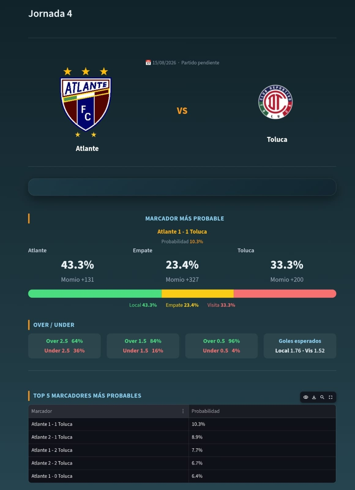
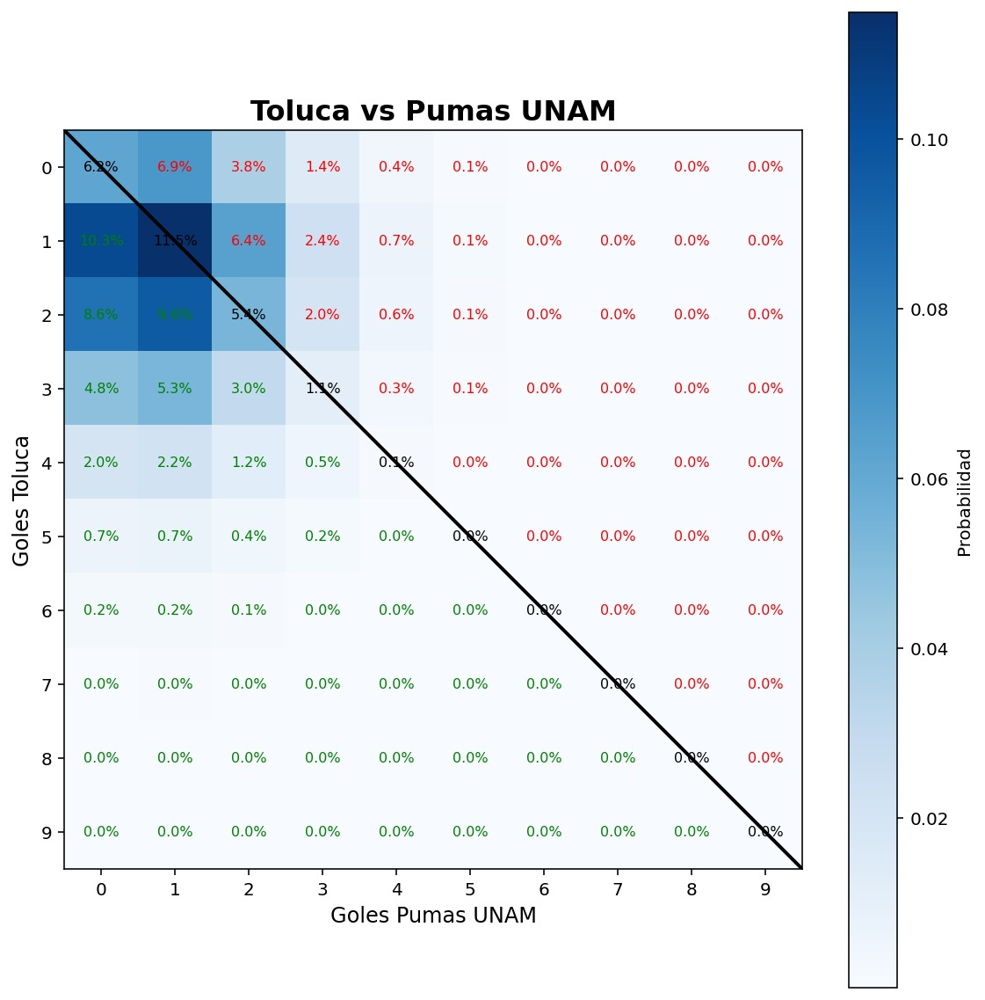

# Sistema de Predicción de Resultados de la Liga MX
https://predictorligamx.streamlit.app
Sistema de predicción de resultados de la Liga MX utilizando modelos estadísticos y aprendizaje automático.
## Autor

Pablo Durán

## Características

- Modelo Poisson
- Dixon-Coles con decaimiento temporal
- Actualización automática
- Interfaz en Streamlit
- Aun por implementar MCMC y ensamble

## Tecnologías

- Python
- Pandas
- NumPy
- SciPy
- Statsmodels
- Streamlit

## Instalación

pip install -r requirements.txt

streamlit run app.py

  

  

